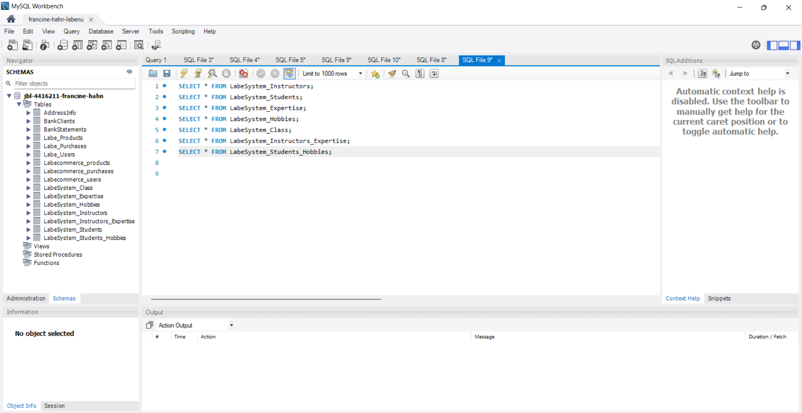

<h1 align="center">API Rest LabeSystem</h1>

##  ℹ️About
API REST developed with the objective of simulating Labenu system and practicing Node.js, TypeScript, Express, Knex, and MySQL. CRUD (Create, Read, Update and Delete) requests were built respecting the semantics and organization necessary for the elaboration of an API with RESTful principles.

##  👩‍💻Developers
- <a href="https://github.com/francinehahn" target="_blank">
Francine Hahn
</a>
- <a href="https://github.com/gioivieira" target="_blank">
Giovana Inez Vieira
</a>
- <a href="https://github.com/mariafmf" target="_blank">
Maria Fernandez de Moura Ferro
</a>

## 🔗Documentation
https://documenter.getpostman.com/view/22375317/2s8Z73zWfy

## Deploy
https://labenu-system.onrender.com

## ☑️Requests
- Get All Instructors
- Get All Students
- Get Students By Hobbies
- Get Students and Instructors By Class
- Get Users Zodiac Signs
- Get Active Classes
- Update Instructor's Class
- Update Student's Class
- Update Class Module
- Create Instructor
- Create Student
- Create Class

## 💻Technologies
- Node.js
- TypeScript
- Express.js
- Knex.js
- MySQL

## 🛰Running the project
1. git clone https://github.com/future4code/Barros-labenu-system2.git
2. cd Barros-labenu-system2
3. npm install
4. npm run start

## Image

